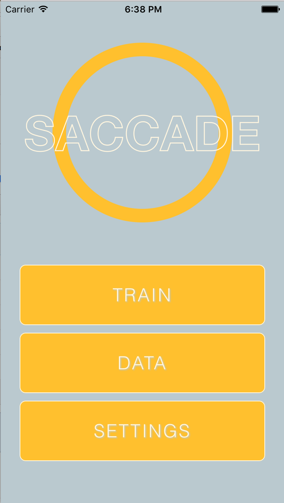
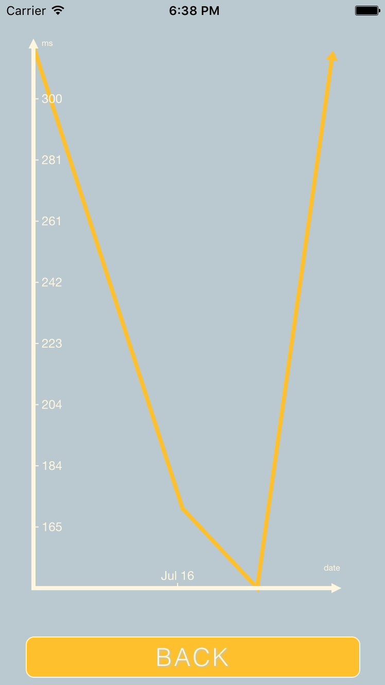

###What's This?

This is a simple iOS application that tests a user's reaction time to a single
stimulus. It records users' reaction speed over time and plots this data in
a graph. This was done entirely in React Native, so it could probably be ported
over to Android with little effort.

###Screenshots

